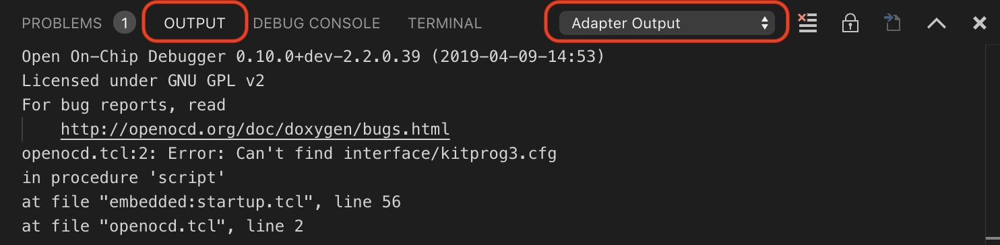

# PSoC6 setup instructions for Cortex-Debug

1. Make sure your board is updated with latest firmware and set to the appropriate mode for OpenOCD. MTB 2.0 has latest. MTB 1.1 may have it as well
2. Install Cortex-Debug 0.3.1 or higher
3. Make sure you have the latest OpenOCD from MTB 2.0 build. Or download [from here](https://drive.google.com/open?id=1fxMy1w-5lRPW1otD7BurX3ukoxdtVCB_)
4. In `settings.json` copy the following lines. You can put this in your workspace `.vscode` directory or in your [global settings](https://code.visualstudio.com/docs/getstarted/settings#_settings-file-locations). Global settings is preferable since they are user and OS specific unless you are working on multiple projects that require different settings

    ```javascript
    // path where objdump and gdb can be found
    "cortex-debug.armToolchainPath": "/Applications/ModusToolbox_2.0/tools/gcc-7.2.1-1.0/bin/",
    // gdb-server-paths
    "cortex-debug.openocdPath": "/Applications/ModusToolbox_2.0/tools/openocd-2.2/bin/openocd",
    "cortex-debug.JLinkGDBServerPath": "/Applications/SEGGER/JLink_V644a/JLinkGDBServerCLExe",
    ```

    You can also set `armToolchainPath` and `serverpath` in your `launch.json`. `servarpath` is generic path of your gdb-server like openocd. You can set these in OS specific ways as well.

5. In `.vscode/launch.json`, have the following configurations. __Make sure__ you edit the `executable` entries below and that all path names are valid for your environment.

    ```javascript
    {
        "name": "Launch PSoC6 CM4 (OpenOCD)",
        "type": "cortex-debug",
        "request": "launch",
        "cwd": "${workspaceRoot}",
        "executable": "BlinkyLED_mainapp/Debug/BlinkyLED_mainapp_final.elf",
        "servertype": "openocd",
        "searchDir": [
            "${workspaceRoot}",
            "/Applications/ModusToolbox/tools_2.0/openocd/scripts/",
        ],
        "configFiles": [
            "openocd.tcl"
        ],
        "overrideLaunchCommands": [
            "set mem inaccessible-by-default off",
            "-enable-pretty-printing",
            "monitor reset init",
            "-target-download",             // Comment this out if you don't want to reload program
            "monitor reset run",
            "monitor sleep 200",
            "monitor psoc6 reset_halt sysresetreq"
        ],
        "postStartSessionCommands": [
            /*
            // Following two commands are needed to get gdb and openocd and HW all in sync.
            // Or, execution context (PC, stack, registers, etc.) look like they are from before reset.
            // The stepi, is a pretend instruction that does not actually do a stepi, but MUST be done
            // Its a documented workaround in openocd. Do a 'monitor help' to see more info
            //
            // An alternative command to use is "continue" instead of the following two
            */
            "monitor gdb_sync",
            "stepi"
        ],
        "overrideRestartCommands": [
            "monitor reset init",
            "monitor reset run",
            "monitor sleep 200",
            "monitor psoc6 reset_halt sysresetreq"
        ],
        "postRestartSessionCommands": [
            "monitor gdb_sync",
            "stepi"
        ],
        // svdFiles are optional, they can be very large.
        "svdFile": "${workspaceRoot}/PSoC_6_Hello_World/libs/psoc6pdl/devices/svd/psoc6_01.svd",
        "runToMain": true,          // if true, program will halt at main. Not used for a restart
        "preLaunchTask": "",        // Set this to run a task from tasks.json before starting a debug session
        "showDevDebugOutput": false,// Shows output of GDB, helpful when something is not working right
    },
    // When using 'attach', make sure your program is running on the board and that your executable matches
    // the image in the chip exactly, or else strange things can happen with breakpoint, variables, etc.
    {
        "name": "Attach PSoC6 CM4 (OpenOCD)",
        "type": "cortex-debug",
        "request": "attach",
        "cwd": "${workspaceRoot}",
        "executable": "BlinkyLED_mainapp/Debug/BlinkyLED_mainapp_final.elf",
        "servertype": "openocd",
        "searchDir": [
            "${workspaceRoot}",
            "/Applications/ModusToolbox_2.0/tools_2.0/openocd/scripts/",
        ],
        "openOCDPreConfigLaunchCommands": [
            "set ENABLE_ACQUIRE 0"
        ],
        "configFiles": [
            "openocd.tcl"
        ],
        "overrideAttachCommands": [
            "set mem inaccessible-by-default off",
            "-enable-pretty-printing",
            "monitor halt"
        ],
        "overrideRestartCommands": [
            "monitor reset init",
            "monitor reset run",
            "monitor sleep 200",
            "monitor psoc6 reset_halt sysresetreq"
        ],
        "postRestartSessionCommands": [
            "monitor gdb_sync",
            "stepi"
        ],
        // svdFiles are optional, they can be very large.
        "svdFile": "${workspaceRoot}/PSoC_6_Hello_World/libs/psoc6pdl/devices/svd/psoc6_01.svd",
        "showDevDebugOutput": false,// Shows output of GDB, helpful when something is not working right
    },
    {
        "name": "Erase (OpenOCD)",
        "type": "cortex-debug",
        "request": "launch",
        "cwd": "${workspaceRoot}",
        "executable": "PioneerKitAppFreeRTOS_mainapp/Debug/PioneerKitAppFreeRTOS_mainapp_final.elf",
        "servertype": "openocd",
        "searchDir": [
            "${workspaceRoot}",
            "/Applications/ModusToolbox/tools_2.0/openocd/scripts/",
        ],
        "configFiles": [
            "openocd.tcl"
        ],
        "overrideLaunchCommands": [
            "monitor reset init",
            "monitor psoc6 sflash_restrictions 1",
            "monitor erase_all",
            "-gdb-exit"
        ]
    },
    {
        "name": "Program (OpenOCD)",
        "type": "cortex-debug",
        "request": "launch",
        "cwd": "${workspaceRoot}",
        "executable": "PioneerKitAppFreeRTOS_mainapp/Debug/PioneerKitAppFreeRTOS_mainapp_final.elf",
        "servertype": "openocd",
        "searchDir": [
            "${workspaceRoot}",
            "/Applications/ModusToolbox/tools_2.0/openocd/scripts/",
        ],
        "configFiles": [
            "openocd.tcl"
        ],
        "overrideLaunchCommands": [
            "monitor psoc6 sflash_restrictions 1",
            "monitor program {PioneerKitAppFreeRTOS_mainapp/Debug/PioneerKitAppFreeRTOS_mainapp_final.elf}",
            "monitor reset_config srst_only",
            "monitor reset run",
            "monitor psoc6.dap dpreg 0x04 0x00",
            "-gdb-exit"
        ],
    }
    ```

6. In your workspace directory, create a file called `openocd.tcl` with the following contents

    ```tcl
    source [find interface/kitprog3.cfg]
    source [find target/psoc6.cfg]
    ${TARGET}.cm0 configure -gdb-port disabled
    ${TARGET}.cm4 configure -rtos auto -rtos-wipe-on-reset-halt 1
    ```

7. Besides the 'Debug Console', look in the Output tab next to it (select the 'Adapter Output` from the dropdown) to see the output from the gdb-server. If the OpenOCD server does not start properly, you will see some messages here.

    

8. FreeRTOS notes: Depending on the version, you may not have all the symbols required for OpenOCD to detect the rtos. Specifically, the symbol `uxTopUsedPriority`. [See this file](https://github.com/gnu-mcu-eclipse/openocd/blob/20b0eca0490fbc4f38f69eed8542cb082b354b03/contrib/rtos-helpers/FreeRTOS-openocd.c#L20). Make sure you compile it as "C" code and not "C++". Use `objdump` or some such utility to make sure your final executable contains this symbol.
